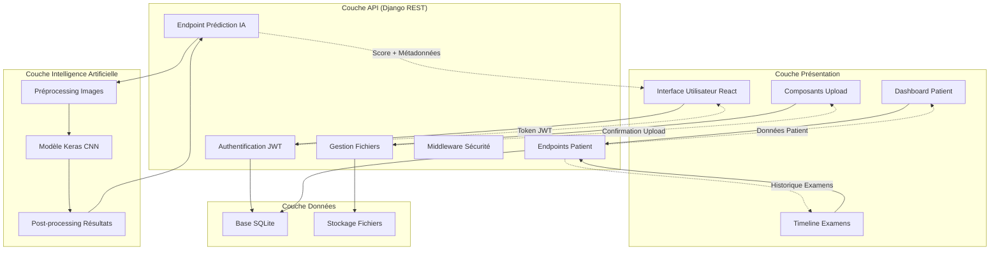
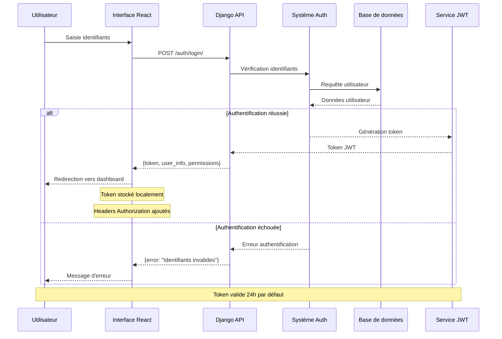
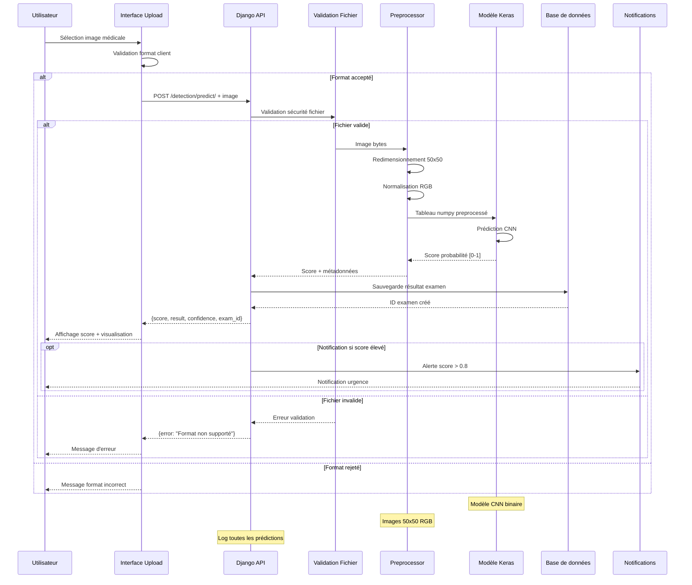
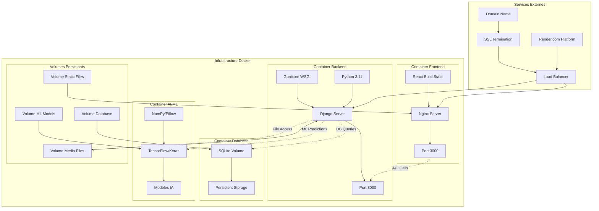
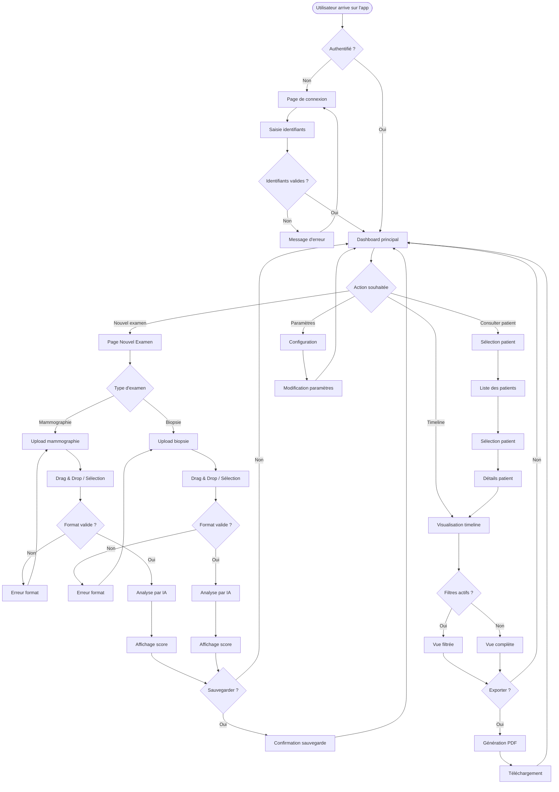
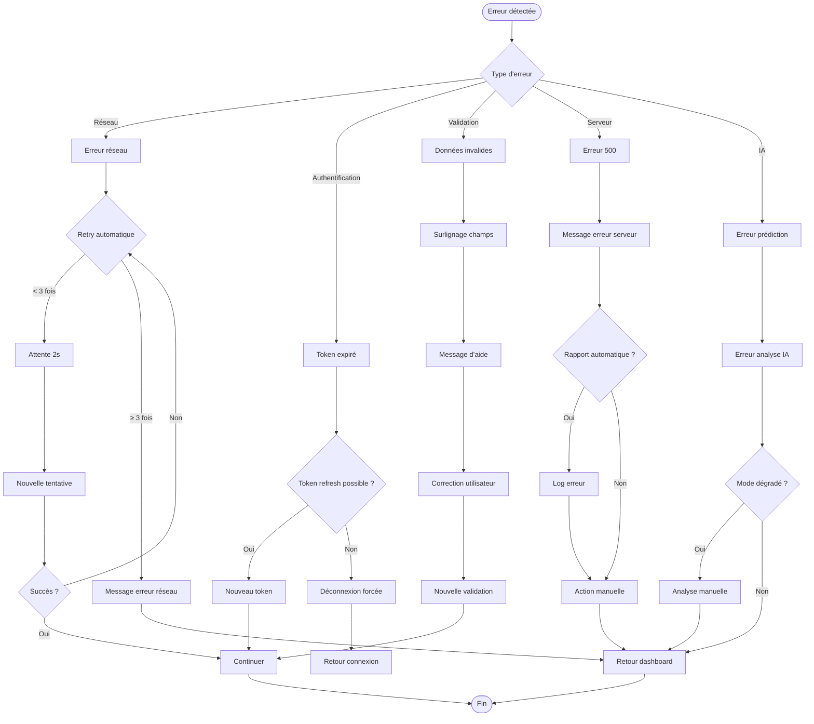
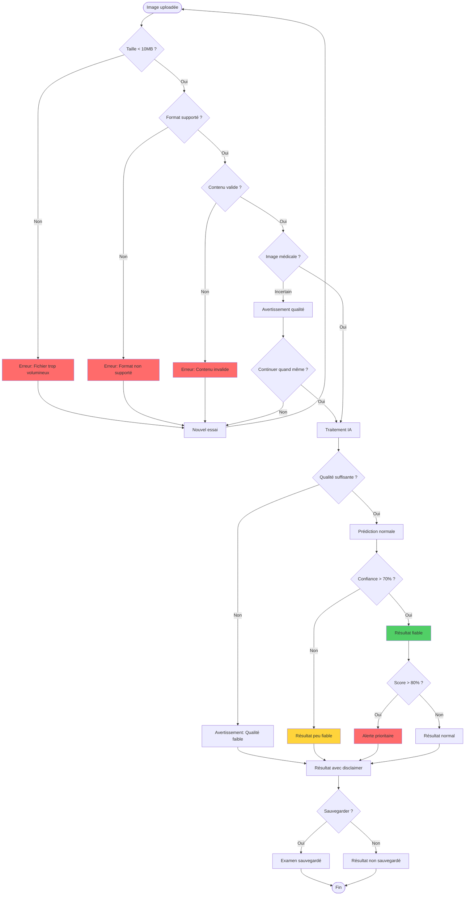
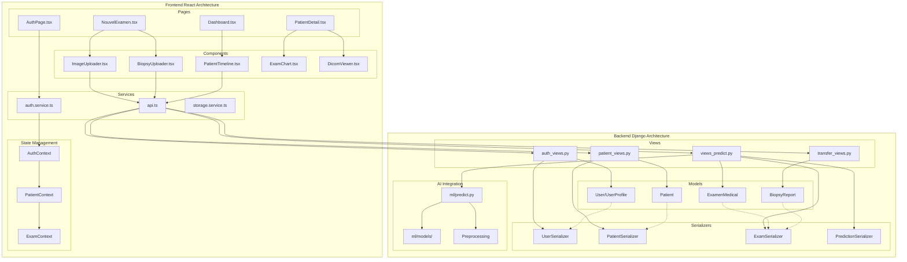
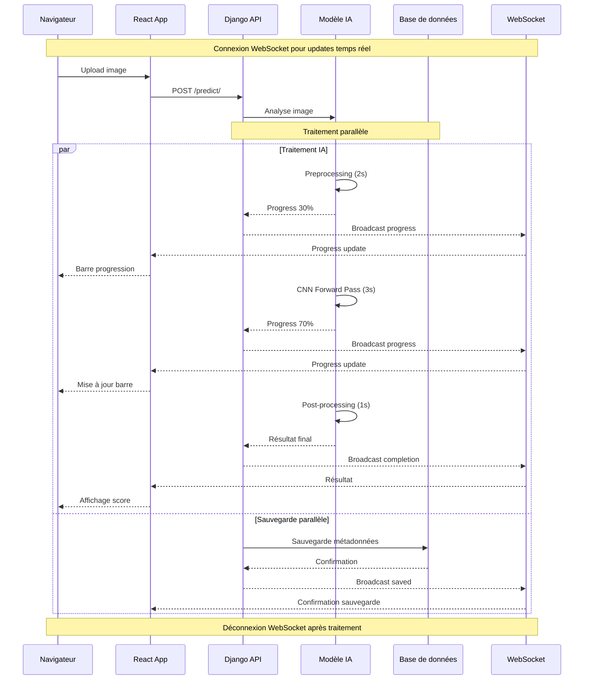

# Diagrammes des flux de données - DetectionCancer

Cette documentation présente les diagrammes détaillés des flux de données, des processus d'authentification, de prédiction, de l'architecture de déploiement et des interactions utilisateur pour l'application DetectionCancer.

---

## 1. Flux de données global entre Frontend/Backend/IA



---

## 2. Diagramme de séquence - Processus d'authentification



---

## 3. Diagramme de séquence - Processus de prédiction IA



---

## 4. Architecture de déploiement Docker



### Commandes Docker

```bash
# Construction des images
docker-compose build

# Lancement des services
docker-compose up -d

# Services disponibles :
# - frontend: React + Nginx (port 3000)
# - backend: Django + Gunicorn (port 8000)
# - db: SQLite avec volume persistant
```

---

## 5. Interactions utilisateur - Flowcharts

### 5.1 Flux principal d'utilisation



### 5.2 Gestion des erreurs utilisateur



### 5.3 Workflow de validation des images



---

## 6. Architecture détaillée des composants



---

## 7. Flux de données en temps réel



---

## Conclusion

Ces diagrammes illustrent la complexité et la robustesse de l'architecture DetectionCancer :

1. **Flux de données** : Architecture en couches avec séparation claire des responsabilités
2. **Authentification** : Sécurité JWT avec gestion des erreurs
3. **Prédiction IA** : Pipeline complet avec validation et préprocessing
4. **Déploiement Docker** : Infrastructure conteneurisée et scalable
5. **Interactions utilisateur** : UX fluide avec gestion d'erreurs complète

Cette documentation servira de référence pour :

- Le développement de nouvelles fonctionnalités
- La maintenance et le debugging
- L'onboarding de nouveaux développeurs
- L'optimisation des performances
