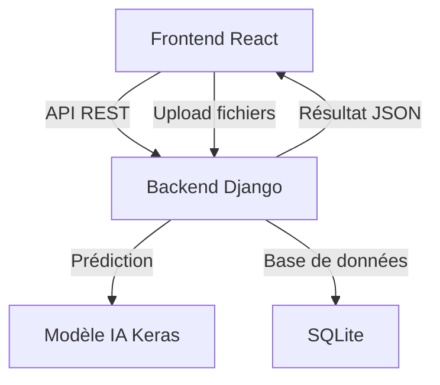

# Documentation complète du projet DetectionCancer

## 1. Présentation

DetectionCancer est une application web permettant la détection du cancer à part## 10. Contact & Support

Pour toute question ou contributio---

## 13. Schéma d'architecture simplifié



_Pour des diagrammes détaillés, consultez [DIAGRAMMES_FLUX.md](./DIAGRAMMES_FLUX.md)_

---

## 14. Guide pour l'ajout de nouvelles fonctionnalités fichier `README.md` ou contacter l'équipe de développement.

---

## 11. Diagrammes et flux de données

Pour une compréhension approfondie de l'architecture et des flux de données, consultez le fichier dédié [`DIAGRAMMES_FLUX.md`](./DIAGRAMMES_FLUX.md) qui contient :

- **Flux de données global** entre Frontend/Backend/IA
- **Diagrammes de séquence** pour l'authentification et la prédiction
- **Architecture de déploiement Docker** détaillée
- **Flowcharts des interactions utilisateur** avec gestion d'erreurs
- **Architecture des composants** React et Django
- **Flux temps réel** avec WebSocket

---

## 12. Exemples d'utilisationages médicales (mammographies, biopsies). Elle combine un backend Django REST, un modèle IA TensorFlow/Keras, et un frontend React moderne. L’objectif est d’offrir aux professionnels de santé un outil sécurisé, intuitif et performant pour l’analyse et la gestion des examens médicaux.

---

## 2. Architecture générale

- **Backend** : Django + Django REST Framework
- **IA** : Modèle Keras (CNN) pour la prédiction du cancer
- **Frontend** : React + TypeScript
- **Base de données** : SQLite (par défaut)
- **Déploiement** : Docker, scripts d’installation, fichiers de configuration pour Render

---

## 3. Backend

### 3.1 Structure des dossiers

- `backend/`
  - `core/` : Configuration principale Django (settings, urls, wsgi, asgi)
  - `detection/` : App principale (modèles, vues, serializers, endpoints API)
  - `db.sqlite3` : Base de données
  - `requirements.txt` : Dépendances Python
  - `manage.py` : Commandes Django

### 3.2 Modèle IA

- **Fichier** : `ml/models/model_v2.keras`
- **Type** : CNN binaire (détection cancer)
- **Entrée** : Image RGB 50x50 pixels
- **Sortie** : Probabilité de cancer (float entre 0 et 1)

### 3.3 Prédiction IA

- **Fichier** : `ml/predict.py`
- **Fonctions principales** :
  - `preprocess_image(image_bytes)` : Prétraitement de l’image (redimensionnement, normalisation)
  - `predict_cancer(image_bytes)` : Prédiction via le modèle Keras

```python
def preprocess_image(image_bytes):
    img = Image.open(io.BytesIO(image_bytes)).convert('RGB')
    img = img.resize((IMAGE_SIZE, IMAGE_SIZE))
    arr = np.array(img) / 255.0
    arr = arr.reshape(1, IMAGE_SIZE, IMAGE_SIZE, CHANNELS)
    return arr

def predict_cancer(image_bytes):
    arr = preprocess_image(image_bytes)
    pred = model.predict(arr)[0][0]
    return float(pred)
```

### 3.4 Endpoints API

- `/detection/predict/` : POST, upload d’image, retourne le score IA
- Autres endpoints : gestion des patients, examens, utilisateurs, etc.

### 3.5 Sécurité

- Authentification par token (JWT ou session)
- Permissions par rôle (médecin, admin, etc.)

---

## 4. Frontend

### 4.1 Structure des dossiers

- `frontend/`
  - `src/` : Code source React
    - `components/` : Composants réutilisables (upload, timeline, chart, etc.)
    - `pages/` : Pages principales (ex : `NouvelExamen.tsx`)
    - `api.ts` : Fonctions d’appel API centralisées
  - `public/` : Fichiers statiques
  - `Dockerfile`, `nginx.conf` : Déploiement

### 4.2 Fonctionnalités principales

- **Upload multi-format** : Drag & drop, sélection de fichiers (images, PDF)
- **Bloc IA harmonisé** : Prédiction disponible pour Mammographie et Biopsie, affichage du score, gestion des erreurs et du chargement
- **Timeline patient** : Visualisation des examens et scores IA dans le temps
- **Dashboard** : Recherche, filtrage avancé, gestion des patients

### 4.3 Exemple d’appel API (frontend)

```typescript
// src/api.ts
export async function apiFetch(url: string, options: RequestInit = {}) {
  // ...gestion du token, des erreurs, etc.
}
```

---

## 5. Déploiement & Installation

### 5.1 Docker

- `docker-compose.yml` : Lance le backend, le frontend, la base de données
- `backend/Dockerfile`, `frontend/Dockerfile` : Images personnalisées

### 5.2 Scripts

- `install-frontend.sh` : Installation des dépendances frontend

### 5.3 Render

- `render.yaml`, `render-frontend.yaml` : Configuration pour Render.com

---

## 6. Utilisation

1. **Démarrage local** :
   - Backend : `python manage.py runserver` (ou via Docker)
   - Frontend : `npm start` (ou via Docker)
2. **Accès** :
   - Interface web : formulaire d’upload, prédiction IA, gestion des patients
   - API REST : endpoints sécurisés pour intégration externe

---

## 7. Extensibilité

- Ajout de nouveaux modèles IA : placer le fichier dans `ml/models/`, adapter `predict.py`
- Extension des formats supportés : modifier le frontend et le backend pour gérer d’autres types de fichiers
- Personnalisation des rôles et permissions : adapter les serializers et les vues Django

---

## 8. Bonnes pratiques

- Centraliser la logique d’appel API côté frontend (`api.ts`)
- Séparer les composants React pour une meilleure maintenabilité
- Utiliser des migrations Django pour la gestion de la base de données
- Documenter chaque fonction et classe importante dans le code

---

## 9. Références de code

- **Backend** : `backend/detection/views_predict.py`, `backend/detection/urls.py`
- **Frontend** : `frontend/src/pages/NouvelExamen.tsx`, `frontend/src/api.ts`
- **Modèle IA** : `ml/predict.py`, `ml/models/model_v2.keras`

---

## 10. Contact & Support

Pour toute question ou contribution, se référer au fichier `README.md` ou contacter l’équipe de développement.

## 11. Exemples d’utilisation

### Exemple 1 : Prédiction IA via l’interface web

1. Connectez-vous à l’application.
2. Rendez-vous sur la page "Nouvel Examen".
3. Sélectionnez l’onglet "Mammographie" ou "Biopsie".
4. Glissez-déposez ou sélectionnez une image médicale.
5. Cliquez sur "Analyser par IA".
6. Le score de probabilité de cancer s’affiche instantanément.

### Exemple 2 : Appel API pour prédiction

```bash
curl -X POST \
  -H "Authorization: Bearer <token>" \
  -F "image=@/chemin/vers/image.png" \
  http://localhost:8000/detection/predict/
```

Réponse :

```json
{
  "score": 0.87,
  "result": "Cancéreux"
}
```

### Exemple 3 : Visualisation timeline patient

1. Accédez au dossier patient.
2. Consultez la timeline des examens et des scores IA.
3. Filtrez par date, type d’examen, ou score.

---

## 12. Schéma d’architecture


---

## 13. Guide pour l’ajout de nouvelles fonctionnalités

### 1. Ajouter un nouveau modèle IA

- Placer le fichier du modèle dans `ml/models/`
- Adapter `ml/predict.py` pour charger et utiliser le nouveau modèle
- Mettre à jour l’endpoint `/detection/predict/` si besoin

### 2. Support d’un nouveau format de fichier

- Adapter le frontend pour accepter le format (ex : PDF, DICOM)
- Ajouter la logique de traitement dans le backend (conversion, extraction d’image)
- Tester l’upload et la prédiction

### 3. Nouvelle fonctionnalité côté frontend

- Créer un nouveau composant React dans `frontend/src/components/`
- Ajouter la page ou l’intégration dans `frontend/src/pages/`
- Utiliser `api.ts` pour les appels API

### 4. Extension des endpoints API

- Créer une nouvelle vue dans `backend/detection/views.py`
- Ajouter le routeur dans `backend/detection/urls.py`
- Créer le serializer si besoin

### 5. Ajout de permissions ou rôles

- Adapter les permissions dans les vues Django
- Mettre à jour la gestion des utilisateurs

---

## 16. Comparatif des hébergeurs (CPU/GPU)

Pour choisir l’hébergement le plus adapté à DetectionCancer, consultez le document détaillé :

- [Comparatif_Hebergeurs_DetectionCancer.pdf](./Comparatif_Hebergeurs_DetectionCancer.pdf)
- [Comparatif_Hebergeurs_DetectionCancer.md](./Comparatif_Hebergeurs_DetectionCancer.md)

### Synthèse rapide

| Hébergeur   | Type    | Prix/h (XOF) | GPU dispo | Rapidité   | Sécurité   | Auto-deploy GitHub |
| ----------- | ------- | ------------ | --------- | ---------- | ---------- | ------------------ |
| Render      | CPU     | Gratuit/600  | Non       | Bonne      | Bonne      | Oui                |
| Vercel      | CPU     | Gratuit/600  | Non       | Bonne      | Bonne      | Oui                |
| Paperspace  | GPU/CPU | 240-600      | Oui       | Excellente | Très bonne | Oui                |
| Lambda Labs | GPU/CPU | 300-900      | Oui       | Excellente | Très bonne | Oui                |
| Vast.ai     | GPU/CPU | 120-600      | Oui       | Variable   | Variable   | Oui                |

**Recommandation :**

- Pour un projet ML/API avec GPU : Paperspace est le meilleur compromis (prix, rapidité, sécurité, auto-déploiement GitHub)
- Pour un projet sans GPU : Render ou Vercel sont parfaits

Pour plus de détails, consultez le PDF ou le Markdown dans le dossier `docs`.

---

## 15. Ressources complémentaires

- [Documentation Django](https://docs.djangoproject.com/fr/)
- [Documentation React](https://fr.react.dev/)
- [Documentation TensorFlow/Keras](https://www.tensorflow.org/api_docs/python/tf/keras)
- [Mermaid pour les schémas](https://mermaid-js.github.io/mermaid/#/)

---

Pour toute évolution, suivre les bonnes pratiques de versioning, de tests et de documentation.
